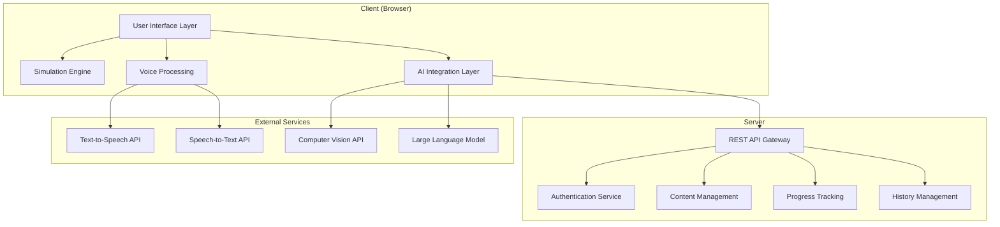

# Design Document: Interactive Tech Tutor

## Overview

The Interactive Tech Tutor is a browser-based learning platform that combines real-time 3D simulations, multi-modal AI interaction, and comprehensive progress tracking. The system leverages WebGL for hardware-accelerated graphics, Web Speech API for voice processing, and modern web technologies to deliver an immersive educational experience.

The architecture follows a modular design with clear separation between presentation, business logic, and data layers. The system supports real-time interaction through voice, text, and visual inputs while maintaining responsive performance across different devices and browsers.

## Architecture

The system follows a client-server architecture with the following high-level components:



### Technology Stack

**Frontend:**
- **WebGL/Three.js**: Real-time 3D graphics and animations
- **Web Speech API**: Native browser speech recognition and synthesis
- **React**: Component-based UI framework
- **TypeScript**: Type-safe development
- **WebRTC**: Real-time communication for voice processing

**Backend:**
- **Node.js/Express**: RESTful API server
- **PostgreSQL**: User data and progress tracking
- **Redis**: Session management and caching
- **JWT**: Authentication tokens

**External APIs:**
- **OpenAI GPT-4**: Multi-modal AI processing
- **Whisper API**: Advanced speech recognition
- **ElevenLabs**: High-quality text-to-speech
- **OpenAI Vision**: Image and document analysis

## Components and Interfaces

### Simulation Engine

The Simulation Engine renders interactive 3D content using WebGL and provides real-time visual feedback.

```typescript
interface SimulationEngine {
  // Core rendering
  initialize(canvas: HTMLCanvasElement): Promise<void>
  render(scene: Scene): void
  animate(deltaTime: number): void
  
  // Content management
  loadTopic(topicId: string): Promise<TopicContent>
  updateSimulation(interactions: UserInteraction[]): void
  
  // User interaction
  handleDragAction(event: DragEvent): ActionResult
  handleScrollAction(event: ScrollEvent): ActionResult
  handleClickAction(event: ClickEvent): ActionResult
  
  // Performance
  setQualityLevel(level: QualityLevel): void
  getPerformanceMetrics(): PerformanceData
}

interface TopicContent {
  id: string
  title: string
  scenes: Scene[]
  narrationScript: NarrationSegment[]
  interactionPoints: InteractionPoint[]
}

interface Scene {
  id: string
  objects: SceneObject[]
  animations: Animation[]
  duration: number
}
```

### Voice Processing System

Handles all voice-related functionality including recognition, synthesis, and real-time processing.

```typescript
interface VoiceProcessor {
  // Speech recognition
  startListening(): Promise<void>
  stopListening(): void
  onSpeechRecognized(callback: (text: string) => void): void
  
  // Speech synthesis
  speak(text: string, options?: SpeechOptions): Promise<void>
  stopSpeaking(): void
  setVoiceSettings(settings: VoiceSettings): void
  
  // State management
  isMuted(): boolean
  setMuted(muted: boolean): void
  isListening(): boolean
  
  // Navigation commands
  processNavigationCommand(command: string): NavigationAction
}

interface SpeechOptions {
  rate: number
  pitch: number
  volume: number
  voice: string
}

interface VoiceSettings {
  narrationEnabled: boolean
  interactionEnabled: boolean
  navigationEnabled: boolean
  preferredVoice: string
}
```

### Multi-Modal AI Integration

Coordinates between different AI services and manages context across interactions.

```typescript
interface MultiModalAI {
  // Text processing
  processTextInput(input: string, context: InteractionContext): Promise<AIResponse>
  
  // Voice processing
  processVoiceInput(audio: AudioData, context: InteractionContext): Promise<AIResponse>
  
  // Visual processing
  processImageInput(image: ImageData, context: InteractionContext): Promise<AIResponse>
  processDocumentInput(document: DocumentData, context: InteractionContext): Promise<AIResponse>
  
  // Feedback generation
  generateActionFeedback(action: UserAction, context: LearningContext): Promise<FeedbackResponse>
  
  // Context management
  updateContext(interaction: Interaction): void
  getContext(): InteractionContext
}

interface InteractionContext {
  currentTopic: string
  userProgress: ProgressData
  recentInteractions: Interaction[]
  learningObjectives: string[]
}

interface AIResponse {
  text: string
  audioUrl?: string
  visualCues?: VisualCue[]
  suggestedActions?: string[]
}
```

### Authentication and User Management

Manages user sessions, authentication, and profile data.

```typescript
interface AuthenticationSystem {
  // Authentication
  login(credentials: LoginCredentials): Promise<AuthResult>
  logout(): Promise<void>
  refreshToken(): Promise<string>
  
  // User management
  getCurrentUser(): Promise<User>
  updateUserProfile(updates: UserProfileUpdate): Promise<User>
  
  // Session management
  isAuthenticated(): boolean
  getSessionInfo(): SessionInfo
}

interface User {
  id: string
  email: string
  profile: UserProfile
  preferences: UserPreferences
  createdAt: Date
  lastLoginAt: Date
}

interface UserPreferences {
  voiceSettings: VoiceSettings
  visualSettings: VisualSettings
  interactionMode: 'voice' | 'click' | 'both'
  difficultyPreference: 'beginner' | 'intermediate' | 'advanced'
}
```

### Progress Tracking System

Monitors and stores user learning progress across topics and difficulty levels.

```typescript
interface ProgressTracker {
  // Progress management
  getProgress(userId: string): Promise<UserProgress>
  updateProgress(userId: string, update: ProgressUpdate): Promise<void>
  
  // Topic completion
  markTopicCompleted(userId: string, topicId: string, level: DifficultyLevel): Promise<void>
  getTopicProgress(userId: string, topicId: string): Promise<TopicProgress>
  
  // Analytics
  getProgressAnalytics(userId: string): Promise<ProgressAnalytics>
  getLearningPath(userId: string): Promise<LearningPath>
}

interface UserProgress {
  userId: string
  completedTopics: CompletedTopic[]
  currentStreak: number
  totalTimeSpent: number
  lastActivity: Date
}

interface CompletedTopic {
  topicId: string
  completedLevels: DifficultyLevel[]
  completionDate: Date
  timeSpent: number
  score: number
}
```

### History Management System

Stores and manages interaction history with selective deletion capabilities.

```typescript
interface HistoryManager {
  // History storage
  storeInteraction(userId: string, interaction: Interaction): Promise<void>
  
  // History retrieval
  getInteractionHistory(userId: string, filters?: HistoryFilters): Promise<Interaction[]>
  getTopicHistory(userId: string, topicId: string): Promise<Interaction[]>
  
  // History management
  deleteTopicHistory(userId: string, topicId: string): Promise<void>
  deleteInteractionRange(userId: string, startDate: Date, endDate: Date): Promise<void>
  
  // Search and analytics
  searchHistory(userId: string, query: string): Promise<Interaction[]>
  getHistoryAnalytics(userId: string): Promise<HistoryAnalytics>
}

interface Interaction {
  id: string
  userId: string
  topicId: string
  type: 'voice' | 'text' | 'action' | 'visual'
  content: string
  response: string
  timestamp: Date
  context: InteractionContext
}
```

## Data Models

### Core Entities

```typescript
// User and Authentication
interface User {
  id: string
  email: string
  passwordHash: string
  profile: UserProfile
  preferences: UserPreferences
  createdAt: Date
  updatedAt: Date
}

interface UserProfile {
  firstName: string
  lastName: string
  avatar?: string
  timezone: string
  language: string
}

// Learning Content
interface Topic {
  id: string
  title: string
  description: string
  category: string
  prerequisites: string[]
  estimatedDuration: number
  content: TopicContent
  createdAt: Date
  updatedAt: Date
}

interface ProblemSet {
  id: string
  topicId: string
  level: DifficultyLevel
  problems: Problem[]
  passingScore: number
}

interface Problem {
  id: string
  question: string
  type: 'multiple-choice' | 'interactive' | 'simulation'
  correctAnswer: any
  explanation: string
  hints: string[]
}

// Progress and Analytics
interface ProgressRecord {
  id: string
  userId: string
  topicId: string
  level: DifficultyLevel
  status: 'not-started' | 'in-progress' | 'completed'
  score: number
  timeSpent: number
  attempts: number
  lastAttempt: Date
}

// Interaction History
interface InteractionRecord {
  id: string
  userId: string
  topicId: string
  sessionId: string
  type: InteractionType
  input: string
  output: string
  context: Record<string, any>
  timestamp: Date
}
```

### Database Schema

```sql
-- Users and Authentication
CREATE TABLE users (
  id UUID PRIMARY KEY DEFAULT gen_random_uuid(),
  email VARCHAR(255) UNIQUE NOT NULL,
  password_hash VARCHAR(255) NOT NULL,
  first_name VARCHAR(100),
  last_name VARCHAR(100),
  avatar_url TEXT,
  timezone VARCHAR(50) DEFAULT 'UTC',
  language VARCHAR(10) DEFAULT 'en',
  created_at TIMESTAMP DEFAULT NOW(),
  updated_at TIMESTAMP DEFAULT NOW()
);

-- Learning Content
CREATE TABLE topics (
  id UUID PRIMARY KEY DEFAULT gen_random_uuid(),
  title VARCHAR(255) NOT NULL,
  description TEXT,
  category VARCHAR(100),
  prerequisites TEXT[], -- Array of topic IDs
  estimated_duration INTEGER, -- in minutes
  content JSONB,
  created_at TIMESTAMP DEFAULT NOW(),
  updated_at TIMESTAMP DEFAULT NOW()
);

CREATE TABLE problem_sets (
  id UUID PRIMARY KEY DEFAULT gen_random_uuid(),
  topic_id UUID REFERENCES topics(id),
  level VARCHAR(20) CHECK (level IN ('beginner', 'intermediate', 'advanced')),
  problems JSONB,
  passing_score INTEGER DEFAULT 70,
  created_at TIMESTAMP DEFAULT NOW()
);

-- Progress Tracking
CREATE TABLE progress_records (
  id UUID PRIMARY KEY DEFAULT gen_random_uuid(),
  user_id UUID REFERENCES users(id),
  topic_id UUID REFERENCES topics(id),
  level VARCHAR(20) CHECK (level IN ('beginner', 'intermediate', 'advanced')),
  status VARCHAR(20) DEFAULT 'not-started',
  score INTEGER DEFAULT 0,
  time_spent INTEGER DEFAULT 0, -- in seconds
  attempts INTEGER DEFAULT 0,
  last_attempt TIMESTAMP,
  created_at TIMESTAMP DEFAULT NOW(),
  updated_at TIMESTAMP DEFAULT NOW(),
  UNIQUE(user_id, topic_id, level)
);

-- Interaction History
CREATE TABLE interaction_history (
  id UUID PRIMARY KEY DEFAULT gen_random_uuid(),
  user_id UUID REFERENCES users(id),
  topic_id UUID REFERENCES topics(id),
  session_id UUID,
  interaction_type VARCHAR(20) CHECK (interaction_type IN ('voice', 'text', 'action', 'visual')),
  input_data TEXT,
  output_data TEXT,
  context_data JSONB,
  created_at TIMESTAMP DEFAULT NOW()
);

-- User Preferences
CREATE TABLE user_preferences (
  user_id UUID PRIMARY KEY REFERENCES users(id),
  voice_settings JSONB,
  visual_settings JSONB,
  interaction_mode VARCHAR(20) DEFAULT 'both',
  difficulty_preference VARCHAR(20) DEFAULT 'beginner',
  updated_at TIMESTAMP DEFAULT NOW()
);
```

Now I need to use the prework tool to analyze the acceptance criteria before writing the Correctness Properties section.

<function_calls>
<invoke name="prework">
<parameter name="featureName">interactive-tech-tutor

## Correctness Properties

*A property is a characteristic or behavior that should hold true across all valid executions of a system—essentially, a formal statement about what the system should do. Properties serve as the bridge between human-readable specifications and machine-verifiable correctness guarantees.*

Based on the prework analysis and property reflection, the following properties validate the system's correctness:

### Property 1: Simulation Content Generation
*For any* valid topic selection, the Simulation Engine should generate visual simulations containing animated elements and maintain synchronization with learning material content.
**Validates: Requirements 1.1, 1.2**

### Property 2: Voice Synthesis and Subtitle Synchronization
*For any* content presentation, the Voice Synthesizer should produce audio narration with perfectly synchronized subtitles that adjust timing proportionally when playback speed changes.
**Validates: Requirements 2.1, 2.2, 2.4, 2.5**

### Property 3: Mute State Independence
*For any* voice mute operation, subtitle display should continue unaffected while voice narration stops.
**Validates: Requirements 2.3**

### Property 4: Multi-Modal Input Processing
*For any* simulation state, the system should accept and process both voice and text inputs, providing contextual AI responses within specified time constraints (2 seconds for voice).
**Validates: Requirements 3.1, 3.2, 3.3**

### Property 5: Input Mode Conditional Processing
*For any* voice interaction disabled state, text-based interactions should continue functioning normally.
**Validates: Requirements 3.4**

### Property 6: UI Layout Consistency
*For any* screen configuration, the Interaction Panel should occupy exactly 25% of the total screen width (half of the right half).
**Validates: Requirements 3.5**

### Property 7: Action Feedback System
*For any* user action (drag, scroll, backward navigation), the system should analyze the action and provide voice feedback with corresponding visual indicators within 1 second.
**Validates: Requirements 4.1, 4.2, 4.3, 4.4, 4.5**

### Property 8: Problem Set Structure Completeness
*For any* topic, the system should provide exactly three difficulty levels (beginner, intermediate, advanced) with appropriate problems for each level.
**Validates: Requirements 5.1, 5.2, 5.3**

### Property 9: Progress Tracking Independence
*For any* user completion activity, progress should be recorded separately for each difficulty level and unlock subsequent levels when criteria are met.
**Validates: Requirements 5.4, 5.5**

### Property 10: Authentication Round Trip
*For any* valid user credentials, successful login should restore the user's complete previous progress state.
**Validates: Requirements 6.1, 6.2**

### Property 11: Progress Persistence and Real-Time Updates
*For any* topic completion, progress indicators should update immediately and persist across user sessions.
**Validates: Requirements 6.3, 6.4, 6.5**

### Property 12: Dual Navigation Support
*For any* menu operation, both voice commands and click/select interactions should produce equivalent results with appropriate feedback.
**Validates: Requirements 7.1, 7.2, 7.3**

### Property 13: Navigation State Preservation
*For any* input mode switch, the current navigation state and context should be maintained, and mode switching should be available at any time.
**Validates: Requirements 7.4, 7.5**

### Property 14: Multi-Modal Content Input Processing
*For any* visual content input (camera or file upload), the system should accept common formats, analyze content with AI, and provide results within 5 seconds while maintaining session context.
**Validates: Requirements 8.1, 8.2, 8.3, 8.4, 8.5**

### Property 15: Comprehensive History Management
*For any* user interaction (voice, text, action), the system should store it with timestamps, provide complete retrieval access, and display history in chronological order.
**Validates: Requirements 9.1, 9.2, 9.5**

### Property 16: Selective History Deletion
*For any* topic-specific deletion request, only associated interaction data should be removed while maintaining integrity of remaining history.
**Validates: Requirements 9.3, 9.4**

### Property 17: Granular Voice Control
*For any* voice setting configuration, simulation voice interaction should be independently controllable from narration and menu navigation, with changes applied immediately and persisted across sessions.
**Validates: Requirements 10.1, 10.2, 10.3, 10.4, 10.5**

## Error Handling

The system implements comprehensive error handling across all components:

### Network and API Errors
- **Connection failures**: Graceful degradation with offline mode for cached content
- **API timeouts**: Retry logic with exponential backoff for external services
- **Rate limiting**: Queue management for API calls with user feedback

### Voice Processing Errors
- **Speech recognition failures**: Fallback to text input with clear user notification
- **Audio device issues**: Automatic device detection and switching
- **Synthesis errors**: Text-only mode with subtitle display

### Simulation Engine Errors
- **WebGL context loss**: Automatic context restoration with state preservation
- **Performance degradation**: Dynamic quality adjustment based on device capabilities
- **Content loading failures**: Progressive loading with placeholder content

### Authentication and Session Errors
- **Token expiration**: Automatic refresh with seamless user experience
- **Session conflicts**: Conflict resolution with user choice preservation
- **Data corruption**: Backup restoration with integrity validation

### Data Persistence Errors
- **Database connection issues**: Local storage fallback with sync on reconnection
- **Concurrent modification**: Optimistic locking with conflict resolution
- **Storage quota exceeded**: Cleanup strategies with user notification

## Testing Strategy

The system employs a dual testing approach combining unit tests for specific scenarios and property-based tests for comprehensive validation.

### Property-Based Testing
Property-based tests validate universal correctness properties using **fast-check** library with minimum 100 iterations per test. Each test references its corresponding design property:

- **Simulation properties**: Generate random topics and verify content generation
- **Voice synchronization**: Test audio-subtitle timing across various playback speeds
- **Multi-modal input**: Validate input processing across different interaction modes
- **Progress tracking**: Verify state management across user sessions
- **History management**: Test data integrity during storage and deletion operations

### Unit Testing
Unit tests focus on specific examples, edge cases, and integration points:

- **Authentication flows**: Login/logout scenarios with various credential states
- **Error conditions**: Network failures, invalid inputs, and system limits
- **UI interactions**: Component behavior and state transitions
- **API integration**: External service communication and response handling

### Integration Testing
End-to-end tests validate complete user workflows:

- **Learning sessions**: Complete topic progression from start to finish
- **Multi-modal interactions**: Voice, text, and visual input combinations
- **Cross-browser compatibility**: WebGL and Web Speech API support
- **Performance benchmarks**: Response times and resource utilization

### Test Configuration
- **Property tests**: Minimum 100 iterations with randomized inputs
- **Coverage targets**: 90% code coverage for critical paths
- **Performance tests**: Response time validation for all timed requirements
- **Accessibility tests**: Screen reader and keyboard navigation support

Each property-based test includes tags in the format:
**Feature: interactive-tech-tutor, Property {number}: {property description}**